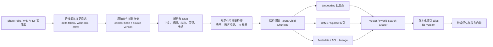
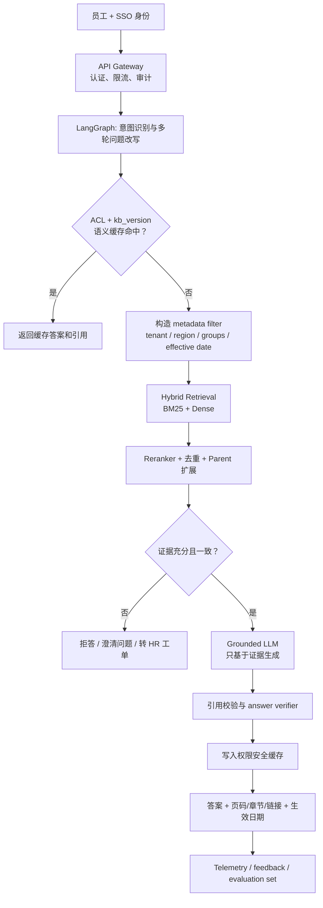
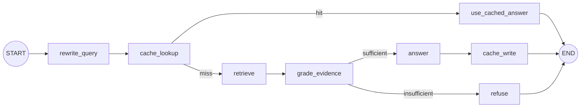

# 企业雇员助手 RAG Engineering Design

状态：Prototype / Design Review  
日期：2026-06-20

## 1. 背景与目标

公司约有 100 万份 PDF，平均每份 50 页，即约 5000 万页。资料分散在 Wiki、SharePoint 和部门文件库中，员工很难快速定位 HR、行政和政策类问题的准确答案。

系统目标：

- 用自然语言回答员工问题，并提供可点击、可核验的原文引用。
- 继承 SharePoint/源系统权限，绝不通过检索或缓存泄露越权内容。
- 政策变化后可增量更新，不依赖重新训练 LLM。
- 证据不足、内容冲突或高风险问题时拒答或升级给 HR。
- 支持中英文、多轮追问、审计和离线评估。

非目标：替代 HR 做个案裁决；回答法律、医疗或薪酬个案；在首期对全部文档构建昂贵的全局知识图谱。

## 2. 规模估算

5000 万页经过版面解析和去重后，按每页约 2–4 个 child chunk 估算为 1–2 亿个 chunk。以 1024 维 FP16 dense vector 计算，单向量约 2 KB，1.5 亿向量原始数据约 300 GB；加 ANN 图、倒排索引、metadata、副本与冷热分层，实际应按约 1–2 TB 规划，而不是把全部内容塞进单机向量库。

生产环境应使用分布式 ingestion、对象存储、搜索集群分片、索引 alias 和按部门/地域的逻辑隔离。

## 3. 数据流程图

### 3.1 离线知识库构建

### 3.2 在线问答

### 3.3 LangGraph 原型状态流

## 4. 关键设计决策

### 4.1 使用什么 Chunking？

推荐“版面/语义结构感知 + parent-child”，不使用只按固定 token 生切：

1. PDF 解析阶段保留标题层级、段落、列表、表格、页码、坐标和跨页关系。
2. child chunk 用于召回，建议 300–600 tokens，重叠 10%–15%。
3. parent chunk 为完整章节或 1,500–3,000 tokens，用于生成上下文。
4. 表格单独结构化；表头必须复制到每个表格分块。政策定义、例外条款和审批流程不要被切开。
5. metadata 至少包括 `doc_id/page/section/version/effective_date/region/department/acl/source_url/content_hash`。

最终大小要通过真实查询集调参。HR 问题常依赖“适用范围 + 规则 + 例外”，parent-child 通常比单层小块更稳。

### 4.2 使用什么 Embedding？

中英混合、自托管首选候选为 BGE-M3：支持 100+ 语言、最长 8192 tokens，并统一支持 dense、sparse 和 multi-vector retrieval。它适合做基线，但仍需用公司查询集比较托管模型、延迟、成本和数据驻留要求。

生产建议：

- 第一阶段：BGE-M3 dense 1024 维 + BM25；Top 50–100 后用 multilingual cross-encoder reranker 排到 Top 8–12。
- 若 GPU/延迟预算允许，在困难集上 A/B 测试 multi-vector/ColBERT late interaction。
- 用公司 HR 缩写、政策号、城市名和中英混合 query 做 hard-negative 微调，而不是凭公开榜单直接定型。
- embedding 模型升级时写新索引，通过 alias 蓝绿切换，禁止在同一向量空间混用版本。

原型用哈希向量，仅为离线可运行。

### 4.3 是否需要 Hybrid Search？

需要。政策查询同时包含：

- 精确词：政策编号、表单名、系统名、城市、金额、日期、缩写；
- 语义表达：“家人生病能请什么假”“晚上打车能不能报”。

BM25 擅长精确匹配，dense 擅长语义改写。推荐各自召回 Top 50–100，使用 RRF 融合，再 rerank。用户身份、地域、文档状态和生效日期必须在候选生成前过滤，不能先召回越权文档再依赖 LLM 忽略。

### 4.4 如何降低幻觉？

采用多层防线：

- 只把通过 ACL 的证据交给模型；将检索内容视为数据，忽略其中的指令，防 indirect prompt injection。
- prompt 明确“只能根据证据回答；没有证据就说不知道；不能合并冲突条款”。
- evidence gate：最低相关性、query coverage、文档有效期和来源权威性。
- reranker、重复文档折叠、冲突检测；同一政策优先最新已生效版本。
- 每个关键事实都带 chunk citation，返回标题、章节、页码、版本和生效日期。
- 生成后 verifier 检查：每个陈述是否能被引用文本蕴含，引用 ID 是否存在。
- 高风险意图（薪酬个案、解雇、签证、法律/医疗）转人工或仅返回流程。
- 用低温度不能替代证据约束；RAG 也不能保证零幻觉。

### 4.5 如何更新知识库？

使用事件驱动增量更新 + 定期 reconciliation：

1. SharePoint delta API/webhook 或数据源变更日志产生 create/update/delete 事件。
2. 以 `source_id + source_version + content_hash` 保证幂等。
3. 内容未变、只改 ACL：仅更新 metadata/ACL，不重新 embedding。
4. 内容变化：解析并只重建受影响的 parent/child chunks。
5. 删除用 tombstone 立即从在线 alias 隐藏，后台回收向量和倒排数据。
6. 批量模型升级构建新索引，离线评估通过后原子切换 alias。
7. 每日对账发现漏事件；记录 lineage、失败队列和可重放事件。

缓存通过 `kb_version` 自动失效；紧急政策撤回还应主动 purge 对应 `doc_id`。

### 4.6 是否需要缓存？如何设计？

需要，但不能只用“问题文本”做 key：

- L1：进程内短 TTL，缓存 embedding、rerank 结果等热点计算。
- L2：Redis semantic/exact cache，保存最终答案、引用和证据指纹。
- key 至少包含 `tenant_id + ACL fingerprint + locale + kb_version + normalized query + model/prompt version`。
- 只缓存 grounded answer；拒答可短 TTL negative cache，避免长期压住新知识。
- 权限变化、文档撤回、知识库版本切换时失效。
- 对个人化问题默认不共享缓存；禁止把某用户可见的答案返回给权限较低用户。
- 热门政策可缓存检索结果，但生成前仍重新验证 ACL、有效期和引用存在性。

### 4.7 如何评估 Retrieval 质量？

建立包含真实员工表达的 gold set，每条 query 标注 relevant chunk/doc、答案、适用地区、权限角色、时间点和 hard negatives。

离线核心指标：

- Recall@K：正确证据是否进入候选集，首要门槛。
- MRR@K / nDCG@K：正确证据是否排在前面。
- Precision@K：上下文噪声。
- ACL leakage rate：必须为 0。
- Freshness accuracy：是否取到指定时间点有效版本。
- Citation coverage / citation precision：答案事实是否有正确引用。
- No-answer accuracy：无证据问题是否正确拒答。

分片报告：语言、地区、部门、问题类型、表格/扫描 PDF、多轮追问。先比较 BM25、dense、hybrid，再分别做 chunk size、RRF 参数、reranker 和 query rewrite 消融实验。

在线指标包括用户追问率、引用点击率、人工升级率、解决率、P50/P95 latency、每问成本和负反馈。不能只用 LLM-as-judge；它适合扩大评估，但要用人工标注集校准。

建议发布门槛示例：

- ACL leakage = 0；
- Recall@20 ≥ 0.92；
- nDCG@10 ≥ 0.80；
- 可回答问题 citation precision ≥ 0.95；
- 不可回答问题正确拒答率 ≥ 0.90。

### 4.8 如何支持多轮对话？

不要把完整聊天历史直接拼入检索：

1. LangGraph checkpointer 按 `tenant_id/user_id/thread_id` 保存状态。
2. 将“那试用期呢？”改写成独立查询，同时保留原始问题用于回答风格。
3. 保存两类记忆：短期对话摘要；结构化 slot，如地区、雇佣类型、办公室、政策主题。
4. 每轮重新检索和重新做 ACL 检查，不能复用上轮证据权限。
5. 用户切换主题、权限或知识库版本时清理相关 slot/cache。
6. 歧义会显著改变答案时先提澄清问题，例如“你所在国家/地区是哪里？”。

原型用启发式指代补全；生产中可用小模型输出结构化 standalone query 和 slots，并做注入防护与长度限制。

## 5. 生产组件建议

| 层 | 建议 |
|---|---|
| Source connector | Microsoft Graph/SharePoint delta、Wiki API、对象存储事件 |
| Parsing | 支持 OCR、表格、页码和 layout 的分布式解析服务 |
| Queue/compute | Kafka/Event Hub + Spark/Ray/Kubernetes workers |
| Storage | 原始文档对象存储 + metadata/lineage DB |
| Search | OpenSearch/Elasticsearch hybrid，按 tenant/region 分片与 alias |
| Embedding | BGE-M3 基线；用内部数据与托管模型做 bake-off |
| Reranker | multilingual cross-encoder，Top 50/100 → Top 8/12 |
| Orchestration | LangGraph，持久 checkpointer，节点级 tracing |
| Cache | Redis，权限指纹与知识版本隔离 |
| Evaluation | 固定 gold set + 线上反馈闭环 + 安全红队 |

## 6. 原型代码含义

- `chunking.py`：模拟结构感知 parent-child chunking。
- `retrieval.py`：先 ACL filter，再分别做 BM25 与本地 dense 检索，使用 RRF 合并。
- `graph.py`：LangGraph 显式表示分支，因此缓存命中、证据不足拒答和后续扩展可追踪。
- `cache.py`：展示为什么企业缓存必须绑定权限和知识库版本。
- `sample_data.py`：包含普通员工政策和受限经理政策，用于验证越权过滤。

## 7. 参考实现与资料

以下参考均在最近两年仍有更新或发布：

- [LangGraph 官方仓库](https://github.com/langchain-ai/langgraph)
- [LangChain 官方 RAG 教程](https://docs.langchain.com/oss/python/langchain/rag)
- [Microsoft GraphRAG](https://github.com/microsoft/graphrag)：适合跨文档主题和关系汇总，建议作为二期路由，不替代默认 hybrid RAG。
- [FlagEmbedding / BGE-M3](https://github.com/FlagOpen/FlagEmbedding)
- [M3-Embedding 论文](https://arxiv.org/abs/2402.03216)

## 8. 后续迭代

1. 接入 1–2 万份已脱敏真实政策，建立 500–1000 条 gold queries。
2. 对比三种 chunking、BM25/dense/hybrid、两种 embedding 和两种 reranker。
3. 接入真实 SSO/ACL，并专门做权限泄露和 prompt injection 红队。
4. 替换抽取式回答为企业批准的 LLM，增加 citation verifier。
5. 压测目标规模，确定 shard、replica、冷热层和批量 embedding 吞吐。
6. 对“比较多个政策/跨部门汇总”问题增加 GraphRAG 路由。

